# Normal Modes at Planetary Scales
   

This repository applied a combination of several highly parallel algorithms to compute the planetary interior normal modes. 
The elastic-gravitational system is discretized using the Continuous Galerkin mixed finite element method. 
A Lanczos approach with polynomial filtering is utilized for solving 
the resulting generalized eigenvalue problems. 

_Self-gravitation and rotation will be included in the future release._ 

**News: This work has been selected to serve as the benchmark for [the student cluster competition](http://www.studentclustercompetition.us/) reproducibility challenge at [SC'19](https://sc19.supercomputing.org). 
Please see [the official announcement](https://sc19.supercomputing.org/2019/04/19/from-sc-papers-to-student-cluster-competition-benchmarks-joining-forces-to-promote-reproducibility-in-hpc/) and [teams named](https://sc19.supercomputing.org/2019/06/10/teams-named-for-sc19-student-cluster-competition/).**

## Normal Modes: the expected outcome  
Many different modes are expected. Please see below for selected normal modes computed from a standard spherically symmetric Earth model.

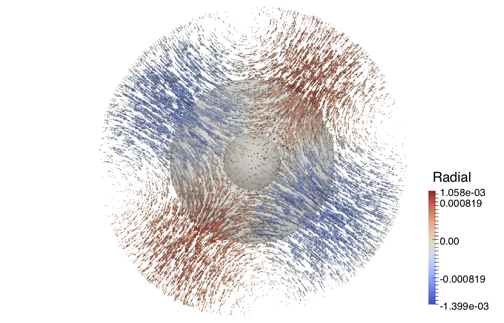 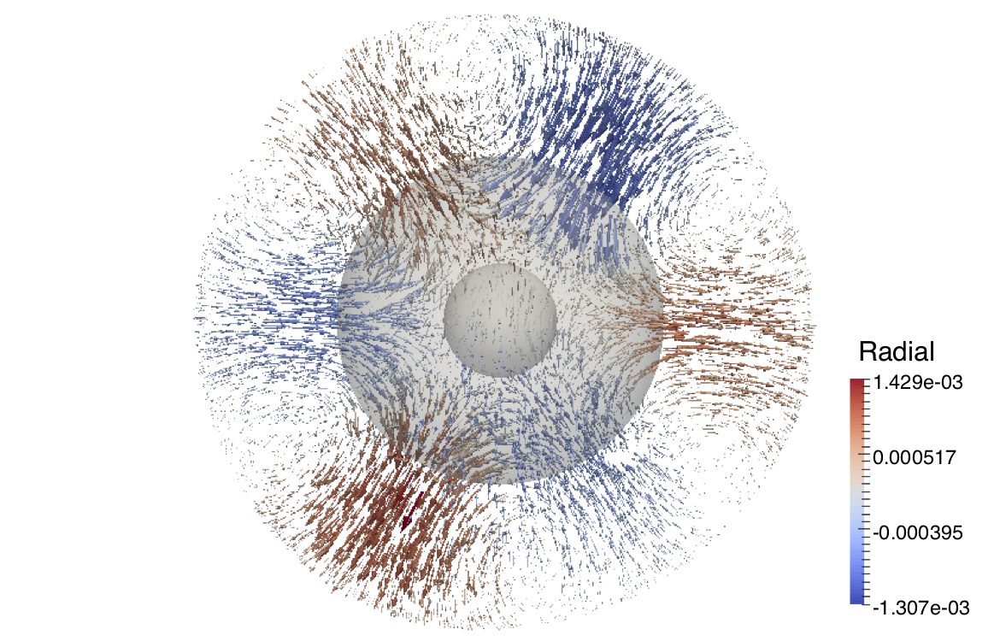 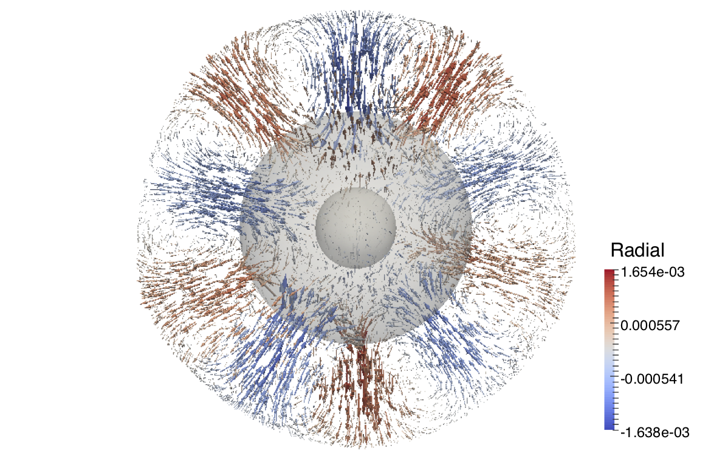  
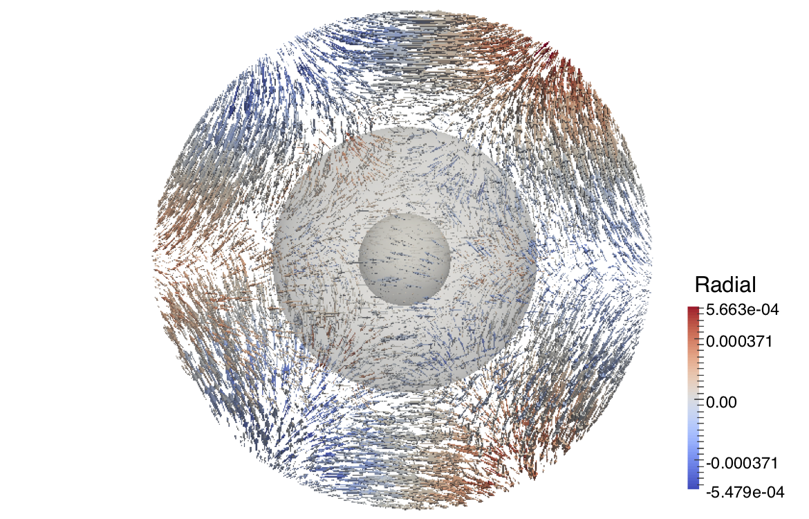 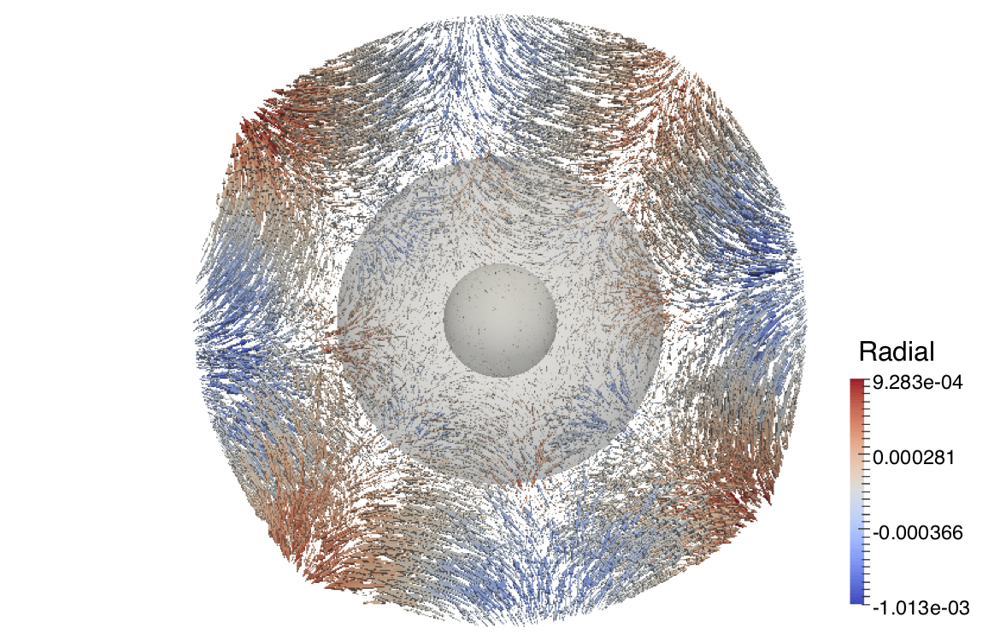 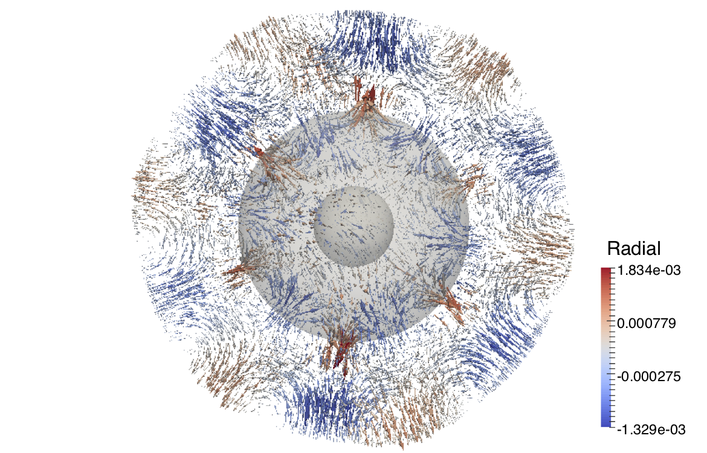 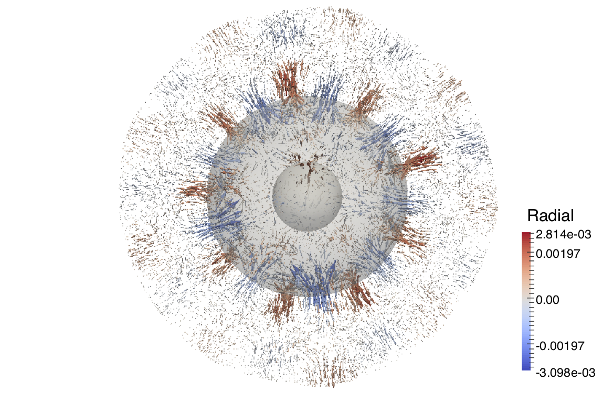 
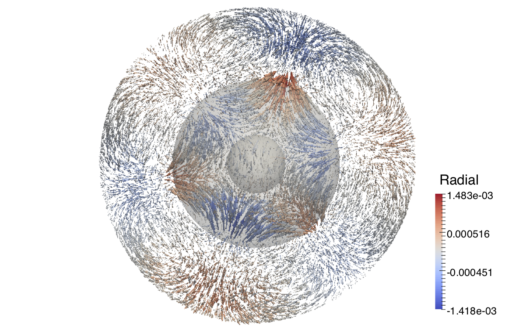 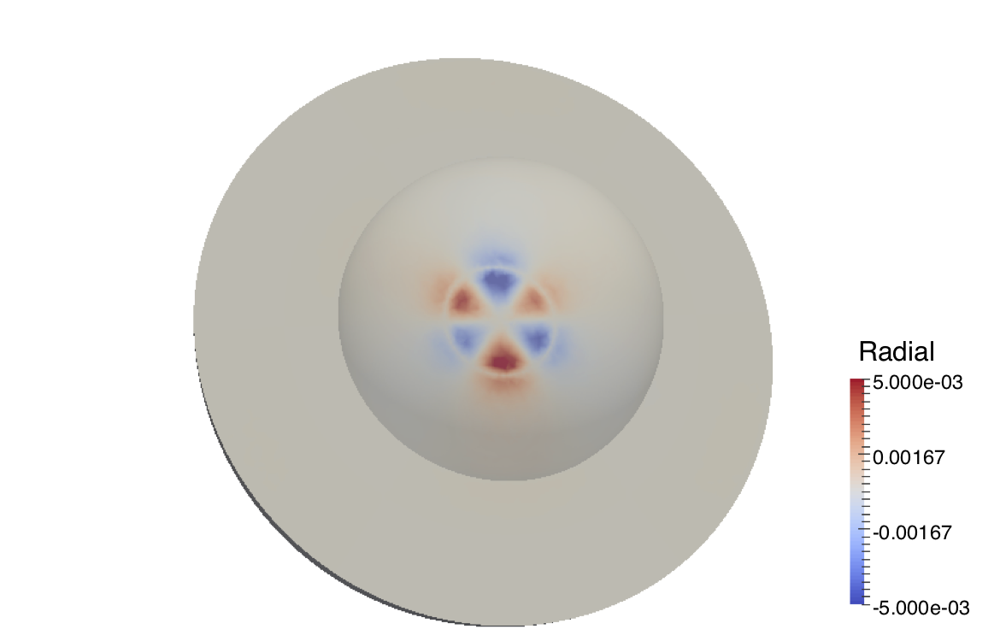 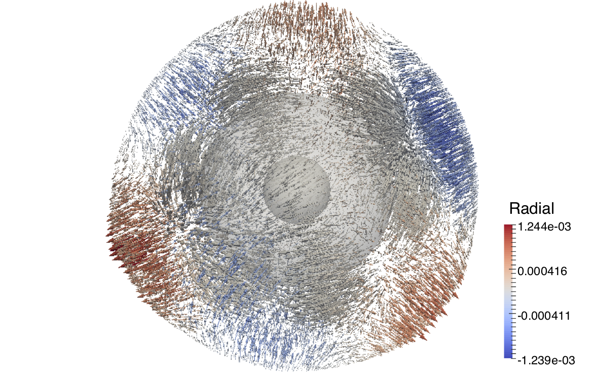 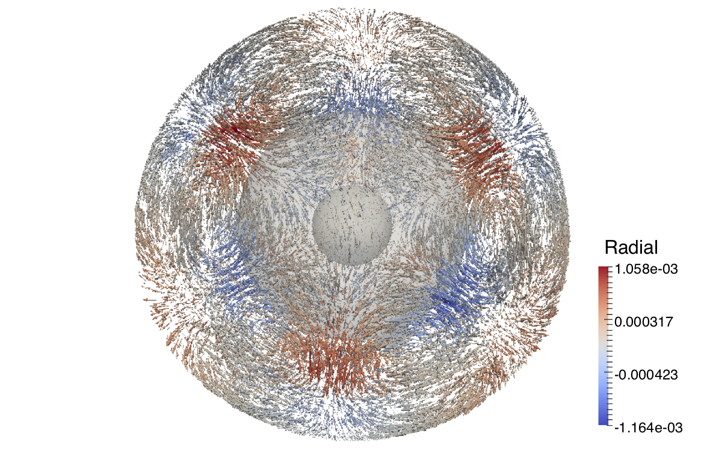 
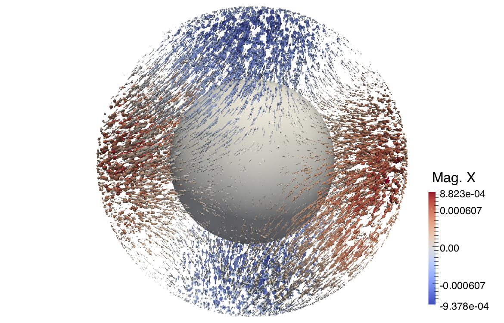 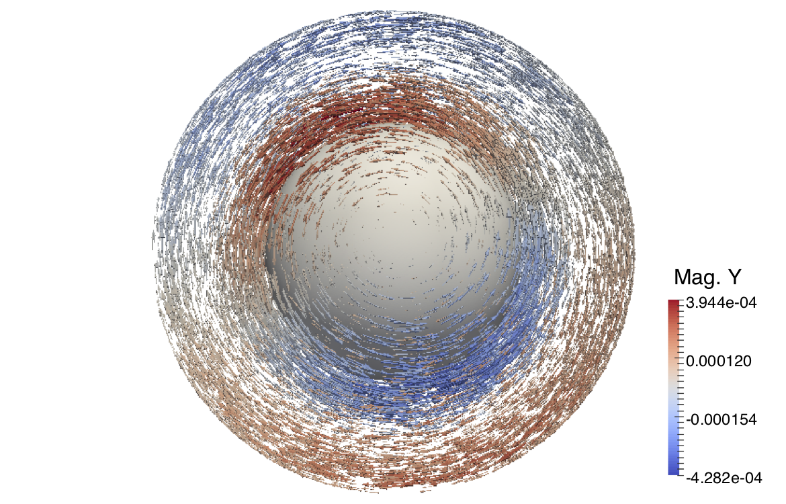 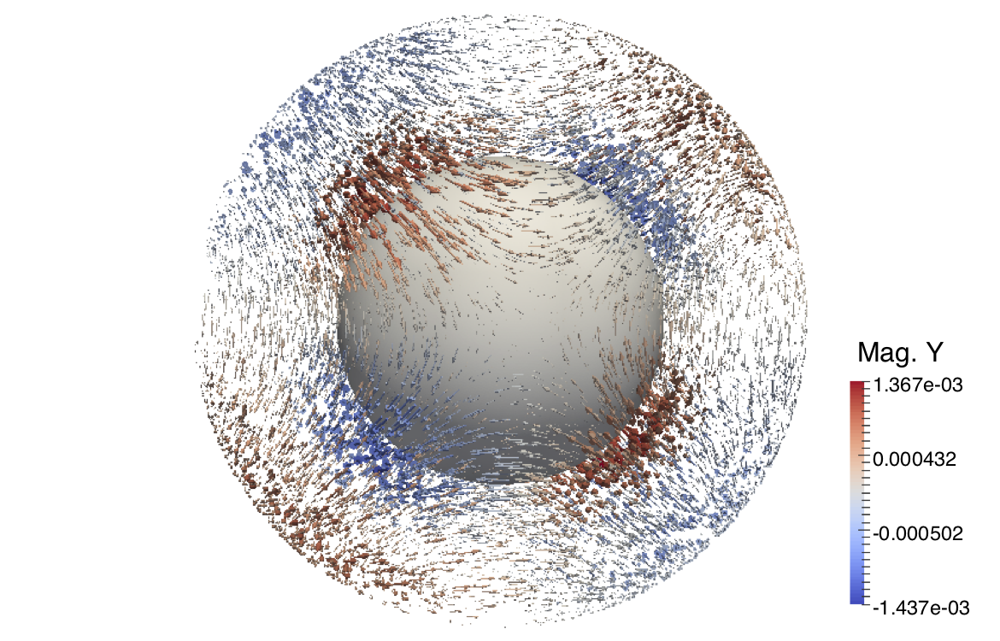 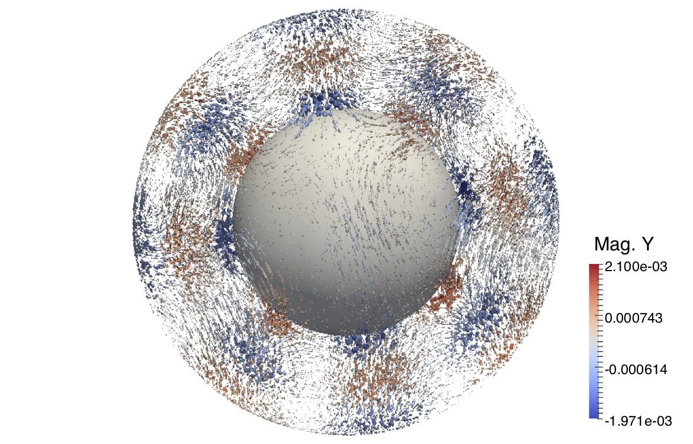 

## A note on our design of the application 
It is not straightforward to compute the normal modes of a fully heterogeneous planet. 
We have to deal with multiphysics at large scales, 
which computationally involves many techniques in numerical linear algebra, finite element method, computer graphics, high-performance computing, etc. 
We do not expect that we can obtain everything via a single click. 
However, to solve this complicated problem, we divide the original one into several smaller subproblems. 
Indeed, via solving each subproblem separately, it actually simplifies our work significantly. 
We develop three repositories to provide a solid solution for this application:
+ [PlanetaryModels](https://github.com/js1019/PlanetaryModels): It is a planet model builder and provides scripts to generate planetary models on fully unstructured tetrahedral meshes. It provides a simple and flexible way to create a 3D body with almost arbitrary exterior and interior shapes.   
+ [pEVSL](https://github.com/eigs/pEVSL): It is a parallel eigenvalue slicing library. It provides general algebraic algorithms to solve large-scale generalized Hermitian extreme and interior eigenvalue problems.    
+ [NormalModes](https://github.com/js1019/NormalModes): It builds up the matrices from the elastic-gravitational system using finite element method and utilizes several external libraries, including [pEVSL](https://github.com/eigs/pEVSL), to solve for the normal modes of the planetary model generated by [PlanetaryModels](https://github.com/js1019/PlanetaryModels). 

The separated repositories also provide flexibility to extend our work for other purposes. 
Please let us know if you plan to utilize what we have to your work.  

## Preparation and installation
**Input**: You need to use the repository [PlanetaryModels](https://github.com/js1019/PlanetaryModels) to create your input planetary models. Several test models are provided in the demos. 

### How to install it? 
Prerequisite: MPI, ParMetis and pEVSL. Intel Math Kernel Library (MKL) is recommended to use pEVSL. 
It runs on multi-CPU platforms. Currently, this code has been tested using GNU, Intel and Cray compilers and scaled up to **40k** processes. 

**Parallel Graph Partitioning** ([ParMetis](http://glaros.dtc.umn.edu/gkhome/metis/parmetis/download)) is used for domain decomposition. To install ParMetis, CMake is needed and please edit metis/include/metis.h and 
change **IDXTYPEWIDTH** to **64**. You can then do 
~~~
make config; make;
~~~
Since CMake is commonly installed in modern clusters, the installation of ParMetis will be easy and simple. 

**Parallel EigenValue Slicing Library** ([pEVSL](https://github.com/eigs/pEVSL)) 
is used to solve the generalized eigenvalue problem. 
You may use [the forked pEVSL version](https://github.com/js1019/pEVSL) 
for this application, since it contains several modifications for your convenience. 
Please edit makefile.in for your cluster. 
We recommend users to use MKL and [Intel link line advisor](https://software.intel.com/en-us/articles/intel-mkl-link-line-advisor) 
to find the right links for you. 
If you do not have MKL, we recommend users to use OpenBLAS or GotoBLAS. 
The installation of pEVSL will be easy and simple. Please check the example to make sure that it is installed correctly. 

**This work**: Once ParMetis and pEVSL are installed, you can install this software. 
Please edit makefile.in for right paths. 
We have two makefile.in examples for GNU and Intel compiler users. 
You may then go to src/ and type 
~~~
make
~~~
The installation will also be easy and simple. 

## How to run this application? 
Please check the demos/global_conf, which shows an **extremely simple** parameter setting. 
Since the problem is deterministic, there are only a few parameters that are needed to compute the normal modes. 
You will then be able to obtain _all_ the eigenpairs in the prescribed frequency interval. 
The values of eigenfrequencies will be shown at the end of the computation as well as their relative errors, i.e., ||Ax-&lambda;Bx||/||&lambda;||, which is typically around **10^-13**. 
The eigenfunctions will be saved in the binary format. Please check the README.md under demos/ for more details. 

**Tips**: Please always check the performance and scalability before running large-scale applications. 

**Visualization**: You will need to use scripts in [PlanetaryModels](https://github.com/js1019/PlanetaryModels) and [Paraview](https://www.paraview.org/) to visualize your results. Here, we show animations created by Paraview: [0S2](https://www.youtube.com/watch?v=DDfGHmqCMN0&list=PLUp2thaj3ruEVTLWazoRfqRK53t4hbYel&index=5&t=0s), 
[0T2](https://www.youtube.com/watch?v=hxeDz8ncNH4), 
[3S9](https://www.youtube.com/watch?v=YR6N3AOTwoU&index=7&list=PLUp2thaj3ruEVTLWazoRfqRK53t4hbYel&t=0s) and
[1T11](https://www.youtube.com/watch?v=XWY_dNAYAjE&index=6&list=PLUp2thaj3ruEVTLWazoRfqRK53t4hbYel&t=0s). 3S9 and 1T11 are illustrated below. 

  

## Reference
The repository and pEVSL contain codes to compute planetary normal modes for [our SuperComputing (SC'18) paper](https://dl.acm.org/citation.cfm?id=3291751), where the parallel strong and weak scalabilities are shown. 
~~~
@inproceedings{shi2018computing,
  title={Computing planetary interior normal modes with a highly parallel polynomial filtering eigensolver},
  author={Shi, Jia and Li, Ruipeng and Xi, Yuanzhe and Saad, Yousef and de Hoop, Maarten V},
  booktitle={Proceedings of the International Conference for High Performance Computing, Networking, Storage, and Analysis, {SC}'18, Dallas, TX, November 11-16, 2018},
  pages={71:1--71:13},
  year={2018},
  organization={ACM/IEEE}
}
~~~

The theory, discretization and validation of our work are described in [a separate paper](https://arxiv.org/abs/1906.11082) on arXiv. 
~~~
@article{shi2019normalmodes,
  title{A Rayleigh-Ritz method based approach to computing seismic normal modes in the presence of an essential spectrum},
  author={Shi, Jia and Li, Ruipeng and Xi, Yuanzhe and Saad, Yousef and de Hoop, Maarten V},
  journal={arXiv preprint arXiv:1906.11082},
  year={2019}
}
~~~

## Contact 
Please report issues under this repository. Contributions are welcome. 
